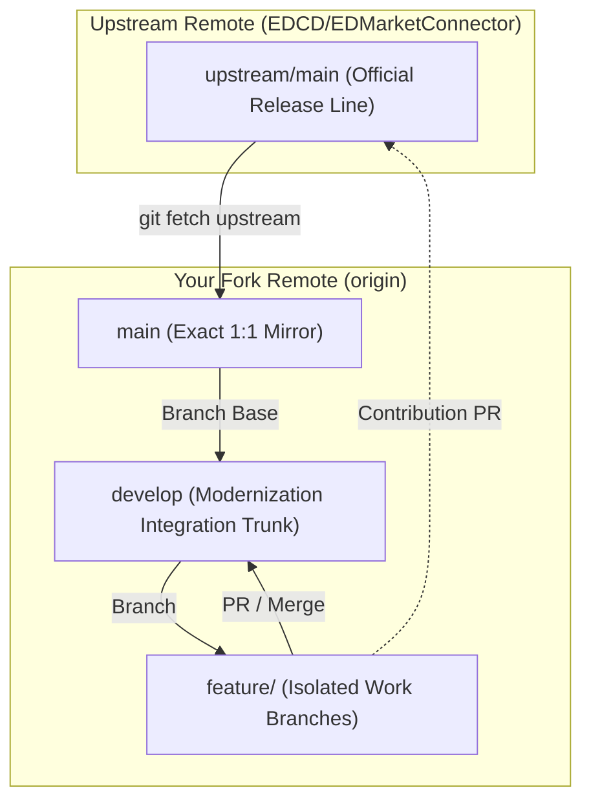

# Elite Dangerous Market Connector (EDMC) - Architecture Modernization Fork

This repository is a dedicated engineering fork of the [EDCD/EDMarketConnector](https://github.com/EDCD/EDMarketConnector) application. 

The primary mission of this fork is to systematically analyze, decouple, and modernize the core software architecture—separating presentation (GUI) from business logic, formalizing domain models and ports & adapters (Hexagonal Architecture), eliminating circular dependencies, and introducing headless test harnesses—while preparing clean, modular pull requests for upstream community adoption.

---

## 1. Architectural Governance

All architectural analysis, engineering ledgers, decision records, and technical designs are governed by the Unified Process (UP) dual-root documentation standard:

* **Engineering Plane (`architecture/`):** Authoritative Single Source of Truth (SSoT) for internal technical governance.
  * [`architecture/README.md`](architecture/README.md): Master architecture index and directory contracts.
  * [`architecture/notes/legacy_repository_audit.md`](architecture/notes/legacy_repository_audit.md): Complete legacy codebase audit, component roles, complexity rankings, and dead-code classifications.
  * [`architecture/risk/risk-list.md`](architecture/risk/risk-list.md): Barry Boehm Master Risk Register ($RE = P \times I$).
  * [`architecture/use-cases/`](architecture/use-cases/): RUP Use-Case Specifications.
  * [`architecture/adr/`](architecture/adr/): MADR 3.0 Architectural Decision Records.
  * [`architecture/designs/`](architecture/designs/): IEEE 1016 Software Design Documents.
  * [`architecture/rfcs/`](architecture/rfcs/): Collaborative engineering proposals.
  * [`architecture/api/`](architecture/api/): OpenAPI 3.1 & AsyncAPI boundary interface contracts.

---

## 2. Git Branching Strategy & Workflow

To maintain absolute compliance with open-source community standards and enable seamless upstream contribution to `EDCD/EDMarketConnector`, this repository strictly enforces the **Upstream-Tracking Fork Model**.



### 2.1 Branch Taxonomy

* **`main` (Pristine Upstream Mirror):**
  * Tracks `upstream/main` (`EDCD/EDMarketConnector`) in lockstep.
  * Contains **zero** custom commits, zero architectural notes, and zero personal modifications.
  * Updated exclusively via fast-forward merges from `upstream/main`.
* **`develop` (Active Integration Trunk):**
  * The primary baseline for fork modernization.
  * Hosts the `architecture/` governance framework, consolidated ledgers, and verified integrated components.
* **`feature/<topic>` (Isolated Work Branches):**
  * Short-lived branches spawned off `develop` to address discrete, bounded milestones (e.g. `feature/config-decoupling`, `feature/mock-journal-emitter`).
  * Merged back into `develop` once completed and verified.
  * Used as the source branch when opening targeted Pull Requests to official `EDCD`.

---

## 3. Operational Rules & Prohibitions

### 3.1 Strict Prohibitions
1. **Never commit directly to `main`:** `main` must never carry custom application code or merge artifacts. Committing to `main` breaks clean upstream diff tracking.
2. **Never rebase or force-push `main` against anything other than `upstream/main`:** The local and origin `main` branches must remain exact mirrors of the official EDCD repository.
3. **Never open monolithic upstream Pull Requests:** Never propose merging `develop` as a single, multi-thousand-line PR to upstream. Upstream contributions must be submitted as isolated, atomic feature branches designed for specific bug fixes or structural enhancements.
4. **Never bypass architecture verification:** No non-trivial subsystem may be modified or introduced without an approved design in `architecture/designs/` or record in `architecture/adr/`.

### 3.2 Upstream Synchronization Protocol

To ingest upstream updates into your local environment:

```bash
# 1. Fetch official upstream changes
git checkout main
git fetch upstream

# 2. Fast-forward local main to match upstream exactly
git merge upstream/main --ff-only

# 3. Push pristine main to your GitHub remote
git push origin main

# 4. Ingest upstream changes into the development trunk
git checkout develop
git merge main
git push origin develop
```

---

## 4. Upstream Project Reference

For upstream user documentation, installation guides, plugin authoring tutorials, and issue tracking, consult:
* Upstream Repository: [EDCD/EDMarketConnector](https://github.com/EDCD/EDMarketConnector)
* Upstream Documentation Wiki: [EDCD Wiki](https://github.com/EDCD/EDMarketConnector/wiki)
* Upstream Discord: [#edmc on EDCD Discord](https://discord.gg/usQ5e6n)
