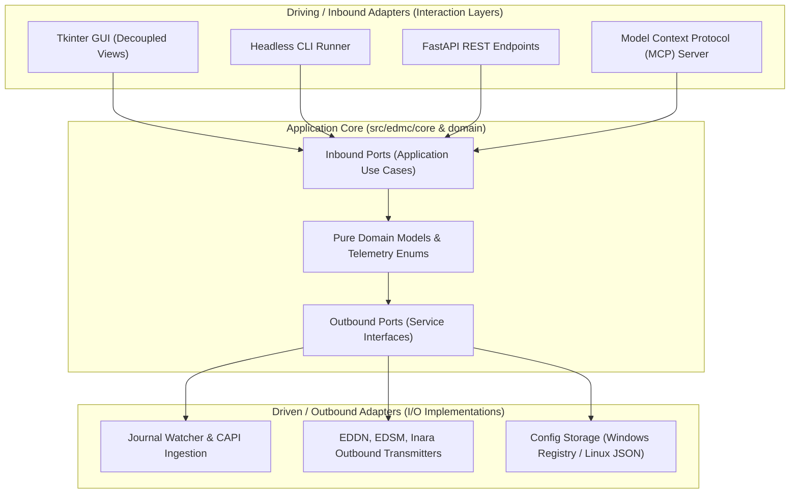

# ADR 0001: Hexagonal Architecture, Multi-Adapter Interfaces, and CI/CD Testing Modernization

## 1. Context and Problem Statement

The legacy Elite Dangerous Market Connector (EDMC) codebase is structured as a monolithic, flat root-level Python application where user interface (Tkinter), background worker threads, file-system polling, configuration storage, and third-party network egress (EDDN, EDSM, Inara) are tightly commingled. 

This coupling creates severe architectural challenges:
1. **Untestable Core:** Core domain and telemetry ingestion logic cannot be tested headlessly in automated environments without instantiating Tkinter event loops.
2. **Monolithic Entry Points:** The application cannot be operated as a headless daemon, modern REST API, or Model Context Protocol (MCP) tool without rewriting or hacking root scripts.
3. **Fragile CI/CD Pipelines:** Legacy GitHub Actions workflows rely on flat requirements files, unpinned pip installs, and manual test runners rather than modern, standardized verification suites (e.g. Ruff, Pytest matrix).
4. **Mixed Documentation Planes:** User manuals and developer/architectural ledgers have historically been commingled, increasing cognitive load and complicating maintenance.

---

## 2. Decision Drivers

* **Maintainability & Extensibility:** Decouple core domain logic from UI presentation and operating system backends.
* **Upstream Contribution Feasibility:** Ensure changes are introduced using Fowler's *Extract Class* and *Encapsulate Implementation* patterns with backward-compatible facades, enabling atomic, bisectable pull requests to `EDCD/EDMarketConnector`.
* **Multi-Client Versatility:** Provide uniform access to game telemetry and CAPI state via decoupled GUI, CLI, REST API (FastAPI), and AI agent tool interfaces (MCP).
* **Deterministic Verification:** Modernize automated testing to achieve fast, headless unit and integration coverage without a running game client.
* **Documentation Hygiene:** Strictly enforce the dual-root documentation boundary (Diátaxis for operators in `docs/`, Unified Process for maintainers in `architecture/`).

---

## 3. Considered Options

* **Option 1: In-Place Procedural Refactoring.** Keep the flat root layout and attempt to decouple functions across root `.py` files.
* **Option 2: Complete Greenfield Rewrite.** Discard the legacy repository and build a completely new application from scratch.
* **Option 3: Ports & Adapters (Hexagonal Architecture) with Core-Out Strangler Fig Extraction (Chosen).** Establish a clean `src/edmc/` package hierarchy governed by explicit inbound/outbound ports, preserve legacy root files as backward-compatible facades, and attach multiple driving adapters (GUI, CLI, FastAPI, MCP).

---

## 4. Decision Outcome

Chosen Option: **Option 3: Ports & Adapters with Multi-Adapter Interfaces and Modernized CI/CD**.

### 4.1 Topology & Package Layout

The application directory structure will adhere to the following package taxonomy:
* `src/edmc/domain/`: Pure, zero-dependency business models, telemetry records, and typed enums.
* `src/edmc/core/ports/`: Abstract interfaces for application commands, queries, and external service contracts.
* `src/edmc/core/services/`: Application orchestrators, event pub/sub dispatchers, and business workflow engines.
* `src/edmc/adapters/ingestion/`: Journal log monitors, file system watchers, and Frontier CAPI client implementations.
* `src/edmc/adapters/egress/`: Outbound network transmitters (EDDN, Inara, EDSM, Coriolis exporters).
* `src/edmc/adapters/storage/`: Platform configuration providers (Windows Registry, Linux file-based).
* `src/edmc/adapters/ui/`: Decoupled Tkinter presentation views and view models.
* `src/edmc/adapters/cli/`: Headless command-line interface.
* `src/edmc/adapters/api/`: FastAPI REST endpoints providing local telemetry streaming.
* `src/edmc/adapters/mcp/`: Model Context Protocol server exposing game state and tool calling for AI agents.

### 4.2 CI/CD Pipeline & Modern Testing Regime

To ensure deterministic quality across platforms:
1. **Packaging & Dependency Management:** Transition build definitions to `pyproject.toml` (PEP 621), declaring explicit dependency groups (`dev`, `test`, `api`, `mcp`).
2. **Unified Verification Stack:**
   * **Linting & Formatting:** Enforce `ruff check` and `ruff format` across the codebase.
   * **Static Type Checking:** Enforce `mypy` type annotations across `src/edmc/`.
3. **Pytest Testing Regime:**
   * `tests/unit/`: Fast, isolated tests verifying pure domain models, exporters, and port contracts headlessly using mock I/O.
   * `tests/integration/`: Component tests verifying file watcher detection, configuration backends, and HTTP adapters.
   * `src/edmc/testing/`: Public `MockJournalWriter` SDK to simulate live Elite Dangerous client log outputs deterministically in CI without a game installation.
4. **Automated CI/CD Workflow:**
   * GitHub Actions matrix testing across Linux and Windows on supported Python versions (3.10+).

### 4.3 Documentation Boundary Compliance

* **Maintainer / Engineering Plane (`architecture/`):** All internal technical designs, risk registers, use cases, ADRs, and RFCs reside exclusively under `architecture/`.
* **Customer / Operator Plane (`docs/`):** Governed strictly by the Diátaxis framework (`tutorials/`, `how-to/`, `reference/`, `explanation/`). Reserved for user runbooks, installation guides, and operator documentation.

---

## 5. Consequences

### Positive
* **Decoupled Architecture:** Core logic is 100% testable headlessly and completely divorced from Tkinter.
* **Versatile Entry Points:** Users can run EDMC as a desktop GUI, background headless CLI, local REST API daemon, or MCP server for AI assistants.
* **Upstream Contribution Safety:** Fowler's facade pattern keeps legacy root files compatible with third-party plugins while allowing piecemeal PR submission to `EDCD/EDMarketConnector`.
* **Modern CI/CD:** Deterministic, fast automated testing replaces manual testing cycles.

### Negative / Trade-Offs
* Requires maintaining backward-compatible facades in the repository root until upstream accepts the refactor.
* Introduces additional development dependencies (`fastapi`, `mcp`, `ruff`).
