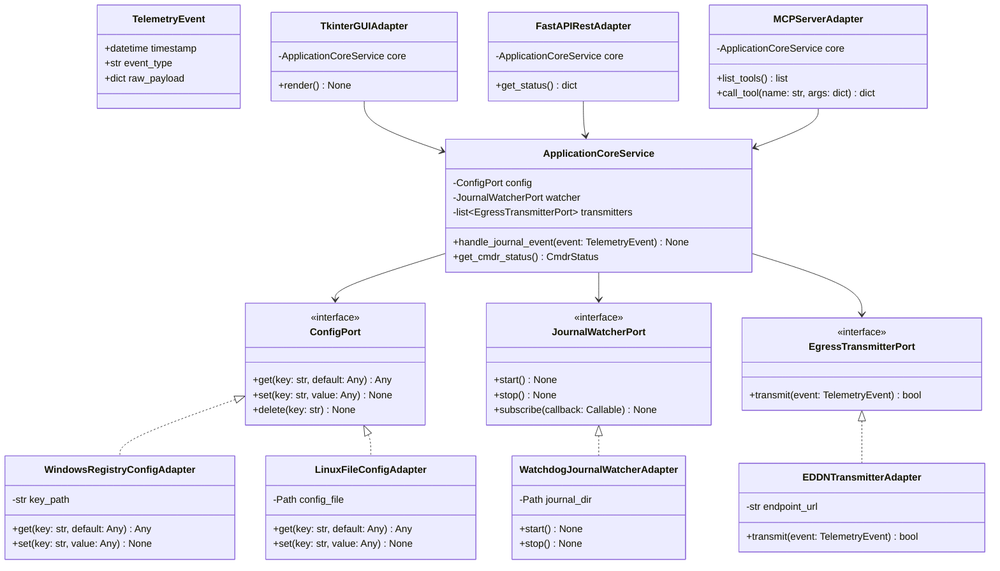
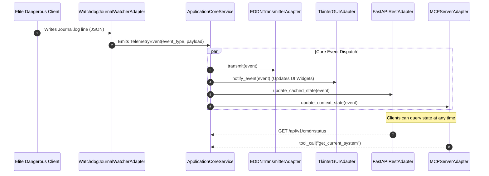

# SDD-001: Hexagonal Architecture Core and Multi-Adapter Topology

## 1. Introduction and Architectural Motivation

### 1.1 Context and Problem Statement
The Elite Dangerous Market Connector (EDMC) application has historically operated as a tightly coupled desktop tool centered around a Tkinter GUI loop. Business rules, data transformations, log monitoring, and third-party network dispatch are commingled in root-level scripts. This architecture prohibits headless execution, prevents deterministic automated testing, and prevents modern integration surfaces (REST APIs, CLI daemons, AI agent tool interfaces).

### 1.2 The Skeptic Test (Why This Architecture?)
A simple procedural refactoring of root files is insufficient. Without formal hexagonal boundary decoupling:
1. Every new feature (e.g. FastAPI daemon or MCP server) would require duplicate data models and manual synchronization with GUI state.
2. Automated testing would remain dependent on GUI event loops or live game client instances.
3. Upstream maintainers cannot review monolithic diffs. By enforcing Ports & Adapters with Fowler facades, every extracted module can be reviewed and merged incrementally without breaking external plugins.

### 1.3 The Vacation Test
This specification details the package layout, abstract port contracts, domain entity models, and adapter lifecycles with sufficient clarity that an independent engineer can implement, test, and verify the subsystem without ad-hoc design decisions.

---

## 2. Structural Component Model (Mermaid)



---

## 3. Dynamic Sequence Flow (Mermaid)

The sequence below illustrates telemetry ingestion flowing from game journal output through the core engine to driving adapters and outbound services:



---

## 4. Package Directory Specification

```text
src/edmc/
|-- __init__.py
|-- domain/                        # Pure domain models (zero external dependencies)
|   |-- __init__.py
|   |-- events.py                  # TelemetryEvent, JournalEvent base classes
|   |-- enums.py                   # GameMode, UIFocus, ShipFlags (from edmc_data.py)
|   \-- models/
|       |-- cmdr.py                # Commander status and rank models
|       |-- ship.py                # Ship configuration and module models
|       \-- market.py              # Commodity and market snapshot models
|-- core/
|   |-- __init__.py
|   |-- ports/                     # Abstract interfaces (Contracts)
|   |   |-- __init__.py
|   |   |-- config.py              # ConfigPort interface
|   |   |-- ingestion.py           # JournalWatcherPort interface
|   |   \-- egress.py              # EgressTransmitterPort interface
|   \-- services/                  # Application business orchestrators
|       |-- __init__.py
|       |-- app.py                 # Core application service coordinator
|       \-- event_bus.py           # In-process pub/sub event router
\-- adapters/                      # Concrete I/O implementations
    |-- __init__.py
    |-- storage/                   # Platform configuration providers
    |   |-- linux.py
    |   \-- windows.py
    |-- ingestion/                 # Watchdog journal monitor and CAPI client
    |   |-- journal.py
    |   \-- capi.py
    |-- egress/                    # Outbound network adapters
    |   |-- eddn.py
    |   |-- inara.py
    |   \-- edsm.py
    |-- ui/                        # Presentation adapters
    |   |-- tk/                    # Decoupled Tkinter views
    |   \-- view_models/           # UI state bindings
    |-- cli/                       # Headless CLI adapter
    |-- api/                       # FastAPI REST endpoints
    \-- mcp/                       # Model Context Protocol server adapter
```

---

## 5. Phased Implementation Milestones

### Phase 1: Test Harness & Tooling Baseline (ADR 0002)
* Rebuild `pyproject.toml` with PEP 621 metadata, `ruff`, and `pytest`.
* Partition `tests/` into `tests/legacy/` and `tests/unit/`.
* Verify that legacy regression tests pass cleanly under headless runner.

### Phase 2: Domain Layer Extraction & Facades
* Extract constants and enums from `edmc_data.py` into `src/edmc/domain/enums.py`.
* Establish root `edmc_data.py` as backward-compatible facade.
* Extract `JournalFileLock` into `src/edmc/core/storage/` with facade in `journal_lock.py`.

### Phase 3: Configuration Port & Platform Adapters
* Implement `ConfigPort` under `src/edmc/core/ports/config.py`.
* Implement `LinuxConfigAdapter` and `WindowsConfigAdapter`.
* Refactor root `config/__init__.py` into a thin delegating facade.

### Phase 4: Telemetry Ingestion & Event Bus
* Implement `JournalWatcherPort` and watchdog adapter in `src/edmc/adapters/ingestion/`.
* Connect in-process `EventBus` to route telemetry events.
* Re-wire root `monitor.py` to delegate to the new ingestion adapter.

### Phase 5: Multi-Adapter Driving Interfaces
* Implement `src/edmc/adapters/cli/` (Headless runner).
* Implement `src/edmc/adapters/api/` (FastAPI REST endpoints).
* Implement `src/edmc/adapters/mcp/` (Model Context Protocol server).
* Refactor `EDMarketConnector.py` into a presentation view observing `ApplicationCoreService`.
