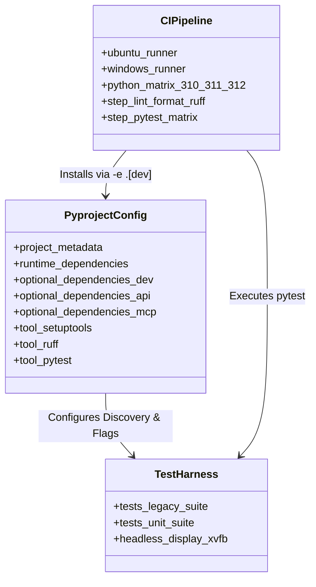
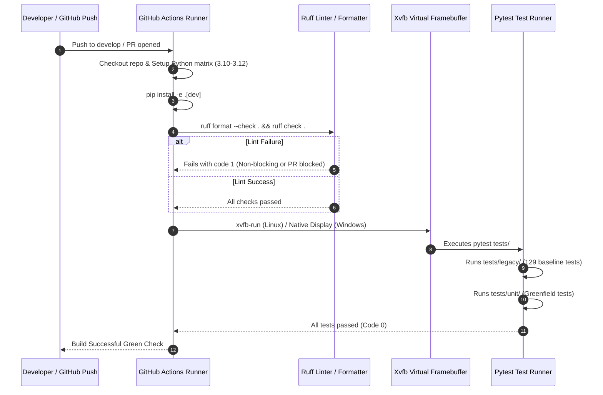

# SDD-002: Packaging Modernization, Test Partitioning, and CI Pipeline Topology

## 1. Introduction and Architectural Motivation

### 1.1 Context and Problem Statement
Before any structural refactoring of legacy code could proceed safely, the repository required an automated, deterministic verification safety net. Upstream EDMC suffered from fragmented dependency declarations (`requirements.txt`, `requirements-dev.txt`), sprawling legacy CI scripts hardcoding `flake8`, and a flat `tests/` directory with no separation between historical regression checks and greenfield unit tests.

### 1.2 The Skeptic Test (Why This Architecture?)
Without unifying the packaging and partitioning the test suite:
1. Modifying legacy files risked breaking undocumented upstream behaviors without immediate automated feedback.
2. Dependencies were unversioned across multiple files, causing environment drift between local development and CI runners.
3. Running tests in headless environments failed on missing X11/Tkinter display contexts (`_tkinter.TclError: no display name and no $DISPLAY environment variable`).

### 1.3 The Vacation Test
This design description documents the complete packaging layout, virtual display integration, test directory partitioning, and CI workflow pipeline such that any engineer can maintain and reproduce the verification stack without relying on undocumented environment variables.

---

## 2. Structural Component Model (Mermaid)

---

## 3. Dynamic CI Verification Flow (Mermaid)

---

## 4. Technical Implementation Details

### 4.1 Packaging Specification (`pyproject.toml`)
* **Standard:** PEP 621 metadata with `setuptools.build_meta` backend.
* **Core Dependencies:** `requests>=2.31.0`, `pillow>=10.0.0`, `watchdog>=3.0.0`, `semantic-version>=2.10.0`, `psutil>=5.9.0`, `tomli-w>=1.0.0`.
* **Platform Conditional:** `simplesystray` and `pywin32` strictly conditioned on `sys_platform == 'win32'`.
* **Optional Groups:**
  - `dev`: `pytest>=8.0.0`, `pytest-cov>=5.0.0`, `ruff>=0.8.0`, `mypy>=1.10.0`, `types-requests`.
  - `api`: `fastapi`, `uvicorn`, `httpx`.
  - `mcp`: `mcp`.
* **Redirects:** Legacy `requirements.txt` and `requirements-dev.txt` preserved as 2-line editable package redirects (`-e .` and `-e .[dev]`).

### 4.2 Test Suite Partitioning
The root `tests/` directory was restructured into two distinct domains:
* `tests/legacy/`: Contains all 14 original test files (`test_config.py`, `test_l10n.py`, `test_outfitting.py`, `test_nb.py`, etc.). Acts as the immutable baseline regression suite.
* `tests/unit/`: Initialized for fast, headless unit tests validating the modern `src/edmc/` domain models, ports, and adapters.

### 4.3 Headless GUI Test Execution
To solve Tkinter initialization errors in headless environments:
* The Linux runtime incorporates `xvfb` (`X Virtual Framebuffer`) via `xvfb-run -a pytest tests/`.
* Allows Tkinter widgets in `test_nb.py` and `test_dashboard.py` to create mock root windows (`tk.Tk()`) without physical monitor hardware.

### 4.4 Streamlined CI Pipeline (`.github/workflows/ci.yml`)
* Replaced `pr-checks.yml` and `push-checks.yml` with a unified matrix workflow running across Ubuntu and Windows against Python 3.10, 3.11, and 3.12.
