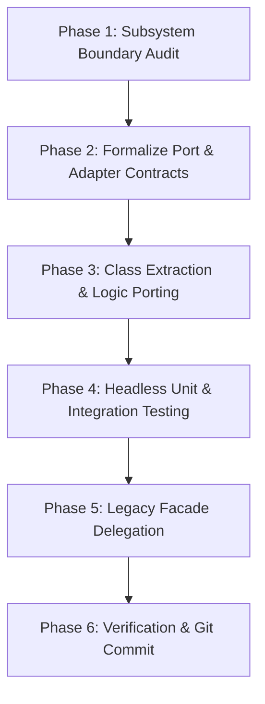

# Fowler's Extract Class and Encapsulate Implementation Workflow

This reference defines the formal principles of Martin Fowler's **Extract Class** and **Encapsulate Implementation** refactoring patterns as applied to the EDMarketConnector codebase. It establishes an immutable, reproducible 6-phase engineering workflow designed to systematically transition procedural legacy scripts into cohesive, object-oriented Ports and Adapters under `src/edmc/`.

---

## 1. Pattern Definitions & Architectural Intent

### 1.1 Extract Class (Fowler Refactoring, 2nd Ed.)
* **Problem:** A module or file does the work of two or more distinct responsibilities. In procedural Python codebases like legacy EDMC, this manifests as loose module-level functions manipulating shared module variables (global state).
* **Remediation:** Create a new class, define clear instance state, and move the relevant subset of fields and functions from the legacy script into cohesive methods on that new class.
* **Architectural Benefit:** Eliminates global mutation, establishes explicit lifecycles, and enables dependency injection.

### 1.2 Encapsulate Implementation / Facade Pattern
* **Problem:** Moving logic to a new location breaks existing callers, third-party plugins, and upstream merge tracking.
* **Remediation:** Leave the legacy module entry points in place, but reduce their internal bodies to thin, 1-to-3 line delegations that instantiate or query the newly extracted class.
* **Architectural Benefit:** Guarantees 100% backward compatibility for downstream consumers (like external plugins or legacy Tkinter loops) while the core logic is modernized.

---

## 2. Reproducible 6-Phase Refactoring Workflow

Follow this cycle sequentially for every subsystem identified in [`architecture/notes/root_directory_reference.md`](root_directory_reference.md).



---

### Phase 1: Subsystem Boundary Audit
1. **Identify the Target:** Select one self-contained module from the root directory (e.g. `journal_lock.py`, `edmc_data.py`, or `config/`).
2. **Catalog Module State:** List all module-level variables (e.g. `_lock_handle`, `config_data`, global dictionaries).
3. **Catalog Public Functions:** List every function called by outside files or plugins.
4. **Identify Hidden Coupling:** Check if the file imports Tkinter, file system globals, or network sockets directly.

---

### Phase 2: Formalize Port & Adapter Contracts
1. **Define the Abstract Port (`src/edmc/core/ports/`):**
   * Declare an abstract base class (`abc.ABC`) specifying the minimal method signatures and return type annotations.
   * Ensure zero dependencies on external frameworks, Tkinter, or operating system quirks.
2. **Determine Domain Models (`src/edmc/domain/`):**
   * If the subsystem exchanges complex dictionaries, define typed `NamedTuple`, `@dataclass(frozen=True)`, or Pydantic models.

---

### Phase 3: Class Extraction & Logic Porting
1. **Create the Concrete Adapter (`src/edmc/adapters/` or `src/edmc/core/`):**
   * Create the new class inheriting from the Port.
   * Move module-level globals into the class constructor (`__init__`) as private instance attributes (`self._state`).
2. **Port Algorithmic Logic:**
   * Move the battle-tested procedural algorithms from the legacy module into concrete class methods.
   * Replace loose global variable mutations with instance state manipulations.
   * Preserve OS-specific edge cases (e.g. Win32 error codes, character encodings).

---

### Phase 4: Headless Unit & Integration Testing
1. **Author Headless Unit Tests (`tests/unit/`):**
   * Write isolated pytest tests targeting the new class directly.
   * Verify all basic flows, edge cases, and failure modes with mocked I/O (e.g. `tmp_path`, `unittest.mock`).
2. **Execute Test Verification:**
   * Ensure tests run and pass without launching Tkinter or requiring a running game client.

---

### Phase 5: Legacy Facade Delegation
1. **Refactor Legacy File:**
   * Open the original root file (e.g. `journal_lock.py`).
   * Import the newly extracted class from `edmc.*`.
   * Instantiate a default instance or factory at module level.
   * Rewrite legacy functions to forward calls directly to the new instance:
     ```python
     # Legacy function preserved for backward compatibility
     def legacy_function(*args, **kwargs):
         return _default_instance.extracted_method(*args, **kwargs)
     ```
2. **Preserve Legacy Public Symbols:**
   * Ensure any constants, exceptions, or variables that plugins import remain accessible at the module level.

---

### Phase 6: Verification & Git Commit
1. **Run Full Test Suite:** Execute `pytest` across the entire repository to ensure no legacy behavior broke.
2. **Execute Ruff Linters:** Run `ruff check` to ensure formatting and linting compliance.
3. **Commit Atomic Changeset:**
   * Commit the changes with an explicit message:
     ```text
     refactor(<subsystem>): extract <ClassName> and delegate legacy module
     ```

---

## 3. Concrete Example: `journal_lock.py`

### 3.1 Legacy Procedural State (Before)
```python
# Legacy root journal_lock.py (Loose globals and functions)
import fcntl
_lock_file = None

def lock(path):
    global _lock_file
    _lock_file = open(path, "r+")
    fcntl.flock(_lock_file.fileno(), fcntl.LOCK_EX)

def unlock():
    global _lock_file
    if _lock_file:
        fcntl.flock(_lock_file.fileno(), fcntl.LOCK_UN)
        _lock_file.close()
        _lock_file = None
```

### 3.2 Extracted Class (Step 3: `src/edmc/core/storage/file_lock.py`)
```python
# Modern object-oriented class with explicit lifecycle & context manager
from pathlib import Path
import fcntl
from typing import Optional, IO

class JournalFileLock:
    def __init__(self, target_path: Path) -> None:
        self.target_path = target_path
        self._file_handle: Optional[IO] = None

    def acquire(self) -> None:
        if not self._file_handle:
            self._file_handle = open(self.target_path, "r+")
            fcntl.flock(self._file_handle.fileno(), fcntl.LOCK_EX)

    def release(self) -> None:
        if self._file_handle:
            fcntl.flock(self._file_handle.fileno(), fcntl.LOCK_UN)
            self._file_handle.close()
            self._file_handle = None

    def __enter__(self) -> "JournalFileLock":
        self.acquire()
        return self

    def __exit__(self, exc_type, exc_val, exc_tb) -> None:
        self.release()
```

### 3.3 Modernized Legacy Facade (Step 5: `journal_lock.py`)
```python
# journal_lock.py (Root backward-compatibility facade)
from edmc.core.storage.file_lock import JournalFileLock

_active_lock: JournalFileLock | None = None

def lock(path: str) -> None:
    global _active_lock
    _active_lock = JournalFileLock(Path(path))
    _active_lock.acquire()

def unlock() -> None:
    global _active_lock
    if _active_lock:
        _active_lock.release()
        _active_lock = None
```

---

## 4. Phase Verification Checklist

Before considering an extraction complete, verify:

- [ ] Does the new class live entirely under `src/edmc/`?
- [ ] Is the new class instantiable without loading Tkinter or GUI libraries?
- [ ] Are all module-level global variables encapsulated into class instance attributes?
- [ ] Does the class implement or satisfy a documented Port interface?
- [ ] Do dedicated unit tests verify the class in isolation under `tests/unit/`?
- [ ] Does the legacy root file re-export all original functions and symbols as a thin facade?
- [ ] Does the entire legacy test suite pass cleanly?
