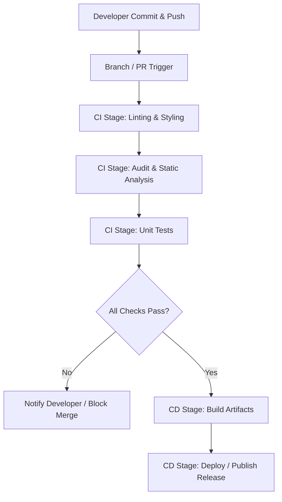

# Transitioning to Declarative Packaging and CI/CD

This document explains the transition from a legacy script-based Python environment setup to a modern declarative configuration using `pyproject.toml` in Elite Dangerous Market Connector (EDMC). It outlines how these updates enable a scalable Continuous Integration and Continuous Deployment (CI/CD) pipeline.

---

## 1. What is a CI/CD Pipeline?

A **CI/CD (Continuous Integration / Continuous Delivery or Deployment)** pipeline is a series of automated steps that monitor a version control repository (like Git) and run validation processes on code changes. Its core objective is to reduce manual deployment overhead and verify code quality.

### Core Stages of a Pipeline:
1. **Linting & Formatting:** Verifies code styling rules (e.g., `flake8`, `black`, `isort`) to keep code readable.
2. **Static Code Analysis (Audit):** Evaluates cyclomatic complexity (`radon`), checks for dead code (`vulture`), and maps dependencies (`pydeps`).
3. **Automated Testing:** Runs test suites (`pytest`, `unittest`) to ensure new modifications do not break existing functionality.
4. **Build & Package:** Compiles source files into distributable formats (e.g., zip files, executables, or python packages).
5. **Deployment:** Pushes the verified artifacts to hosting platforms or package registries (e.g., GitHub Releases, PyPI).

### Visual Pipeline Flow:


---

## 2. Modernizing `pyproject.toml` While Preserving Legacy Settings

Modern Python packaging (conforming to **PEP 517**, **PEP 518**, and **PEP 621**) uses `pyproject.toml` as the single source of truth for dependencies and metadata. 

To introduce these improvements without breaking the application, we append the declarative packaging elements at the top of the file while leaving the existing configurations for `pytest` and `coverage` unchanged.

### Legacy Configuration Preservation
The existing settings for plugins like `pytest.ini_options` and `coverage.run` must be preserved exactly as they are. Any tool that reads [pyproject.toml](file:///home/michael/src/github.com/mnaatjes/EDMarketConnector/pyproject.toml) simply parses the tables it cares about and ignores the rest.

### Updated File Blueprint
Below is the structure of the updated [pyproject.toml](file:///home/michael/src/github.com/mnaatjes/EDMarketConnector/pyproject.toml), showing the integration of the packaging metadata alongside the legacy configurations:

```toml
[build-system]
requires = ["setuptools>=61.0.0"]
build-backend = "setuptools.build_meta"

[project]
name = "edmarketconnector"
version = "5.0.0"
description = "Elite Dangerous Market Connector"
readme = "README.md"
requires-python = ">=3.10"
license = { text = "GPL-2.0" }
dependencies = [
    "requests==2.33.0",
    "pillow==12.3.0",
    "watchdog==6.0.0",
    "semantic-version==2.10.0",
    "psutil==7.2.1",
    "tomli-w==1.2.0",
    "simplesystray==0.1.0; sys_platform == 'win32'",
    "pywin32==311; sys_platform == 'win32'"
]

[project.optional-dependencies]
dev = [
    # Packages for testing, packaging, and linting
]
review = [
    "radon",
    "vulture",
    "pydeps",
    "pylint"
]

# --- LEGACY CONFIGURATIONS (PRESERVED) ---

[tool.autopep8]
max_line_length = 120

[tool.pytest.ini_options]
testpaths = ["tests"]
addopts = "--cov . --cov plugins --cov-report=term-missing --no-cov-on-fail"

[tool.coverage.run]
omit = [ "tests/*", "venv/*", ".venv/*", "dist.win32/*" ]
plugins = [ "coverage_conditional_plugin" ]

[tool.coverage.coverage_conditional_plugin.rules]
sys-platform-win32 = "sys_platform != 'win32'"
sys-platform-not-win32 = "sys_platform == 'win32'"
sys-platform-darwin = "sys_platform != 'darwin'"
sys-platform-not-darwin = "sys_platform == 'darwin'"
sys-platform-linux = "sys_platform != 'linux'"
sys-platform-not-linux = "sys_platform == 'linux'"
sys-platform-not-known = "sys_platform in ('darwin', 'linux', 'win32')"
```

---

## 3. How This Integrates into CI/CD

By defining the review tooling as an optional dependency group (`extras`) in `pyproject.toml`, both local environments and automated pipelines can query and install dependencies dynamically.

### Local Installation:
A developer or reviewer can install only the review tools on top of the base installation using:
```bash
pip install -e .[review]
```

### CI/CD Runner Setup:
In pipelines (like GitHub Actions), rather than keeping list dependencies in YAML files or static scripts, a runner installs review packages directly from the metadata:

```yaml
- name: Install Review Tools
  run: pip install .[review]

- name: Run Complexity Audit
  run: radon cc src/ -a -s
```

This ensures dependency definitions remain unified inside the repository, preventing divergence between what runs on the developer's workstation and what runs in the cloud.
