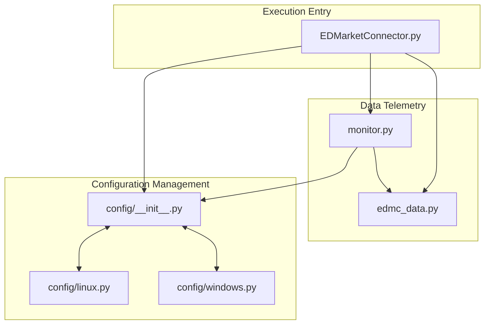

# Component Roles and Responsibilities Map

This reference document outlines the technical roles and operational responsibilities of the core modules identified in the package dependency graph: [packages_EDMC.svg](file:///home/michael/src/github.com/mnaatjes/EDMarketConnector/docs/reference/packages_EDMC.svg).

---

## 1. Core Core Component Mapping

---

## 2. Module Specifications

### 2.1 `EDMarketConnector.py` (GUI Entry Point)
* **File Location:** [EDMarketConnector.py](file:///home/michael/src/github.com/mnaatjes/EDMarketConnector/EDMarketConnector.py)
* **Role:** GUI Application Controller & Bootstrapper.
* **Responsibilities:**
  * Serves as the primary entry point to launch the application with a GUI.
  * Initializes the `tkinter` main event loop, styles the UI window, builds menus, and displays status widgets.
  * Manages the system tray integrations, system hooks, and menu commands.
  * Coordinates task delegation between configuration managers, logging layers, and event listeners.

### 2.2 `monitor.py` (Journal log monitor)
* **File Location:** [monitor.py](file:///home/michael/src/github.com/mnaatjes/EDMarketConnector/monitor.py)
* **Role:** Journal Event Listener and Log Poller.
* **Responsibilities:**
  * Watches and reads the Elite Dangerous local Journal log files written by the game client.
  * Polls directories to identify file updates in real-time.
  * Parses JSON event records (such as FSD jumps, system changes, outfitting, landing, and docking).
  * Extracts telemetric payload data and fires events to update the UI or send data to external third-party servers.

### 2.3 `config/__init__.py` (Configuration Manager)
* **File Location:** [config/__init__.py](file:///home/michael/src/github.com/mnaatjes/EDMarketConnector/config/__init__.py)
* **Role:** Centralized Configuration Manager.
* **Responsibilities:**
  * Exposes the global `config` helper object to retrieve and update user preferences.
  * Abstracts platform-specific differences in registry or filesystem setups.
  * Dynamically delegates read/write logic to the correct platform backend depending on the operating system (`sys.platform`).

### 2.4 `config/linux.py` (Linux Configuration Backend)
* **File Location:** [config/linux.py](file:///home/michael/src/github.com/mnaatjes/EDMarketConnector/config/linux.py)
* **Role:** OS-Specific Storage Provider (Linux).
* **Responsibilities:**
  * Implements file-based storage operations for configurations (typically saving preferences in text/JSON formats within user directories).
  * *Note: Circularly imports the parent `config` module to leverage shared helper operations.*

### 2.5 `config/windows.py` (Windows Configuration Backend)
* **File Location:** [config/windows.py](file:///home/michael/src/github.com/mnaatjes/EDMarketConnector/config/windows.py)
* **Role:** OS-Specific Storage Provider (Windows).
* **Responsibilities:**
  * Implements registry-based storage operations for configurations, writing values directly to the Windows Registry.
  * *Note: Circularly imports the parent `config` module to leverage shared helper operations.*

### 2.6 `edmc_data.py` (Telemetry Data Constants)
* **File Location:** [edmc_data.py](file:///home/michael/src/github.com/mnaatjes/EDMarketConnector/edmc_data.py)
* **Role:** Telemetry and Journal Constant Definition Module.
* **Responsibilities:**
  * Stores lookups, type maps, item schemas, and constant definitions representing the data structure of Elite Dangerous.
  * Defines state flags (e.g. `FlagsDocked`) and ship attributes used by `monitor.py` and third-party plugins.
